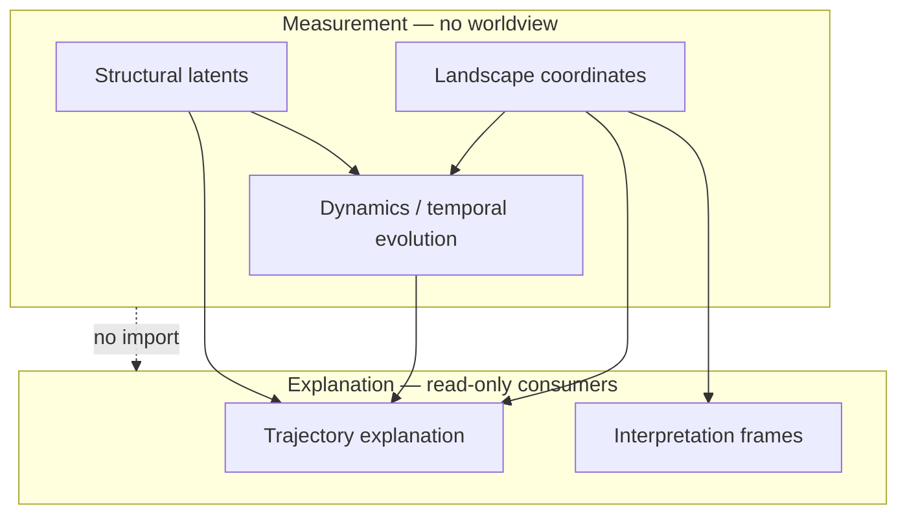

> **Status: Accepted** — This document represents an accepted programme commitment as of the stated version. Accepted directly during the initial single-steward phase of the programme (no separate Proposed comment period); the full Draft → Proposed → Accepted review cycle will apply once the steward group grows (see GOVERNANCE.md).

# CLRP-005: Layer Separation

## Abstract

CLRP requires strict separation between **measurement**, **dynamics**, **structure**, **trajectory explanation**, and **interpretation**. Mixing layers causes ethical harm (diagnostic creep), scientific confusion (causal claims from metaphors), and implementation rot (feedback loops).

## 1. Layer definitions

### Landscape (measurement)

**Produces:** coordinate vectors and uncertainty from observations.  
**Must not:** assign diagnostic labels, moral judgement, or causal real-world claims.

### Dynamics

**Produces:** modelled state transitions over time.  
**Must not:** conflate simulated change with observed change without labelling.

### Structural

**Produces:** latent parameter estimates constraining measurement and dynamics.  
**Must not:** reify latents as immutable traits of moral or clinical significance.

### Trajectory explanation

**Produces:** mechanistic account of **how** coordinates changed **within the model**.  
**Must not:** claim real-world etiology, treatment need, or modify coordinates.

### Interpretation

**Produces:** human-readable reading of coordinates in an explicit, **non-causal** frame.  
**Must not:** alter measurement functions or present frames as sole truth.

## 2. Normative rules

| Rule | Statement |
|------|-----------|
| **R1** | Measurement layers must not depend on interpretation content |
| **R2** | Interpretation may consume measurement outputs read-only |
| **R3** | User worldview selection must not change scores (M6, CLRP-003) |
| **R4** | Simulation outputs must be labelled "simulated" in user-facing contexts |
| **R5** | Trajectory explanation must not introduce new coordinate values |

## 3. Conformance testing

Implementations claiming CLRP-005 conformance should provide **automated or manual tests** demonstrating forbidden dependencies are absent. Test definitions may live in implementation repos; requirements live here.

## 4. Ethical rationale

Layer violations correlate with:

- Diagnostic language entering results screens
- Gamification that optimises interpretation feedback into answers
- Institutions treating narrative summaries as assessment scores

See [CLRP-007](CLRP-007-non-diagnostic-commitment.md).

## 5. Worked example: worldview interpretation frames

R1–R3 are not only policy; they are enforced as software architecture in the CLM implementation's `@clm/interpretation` package, which is illustrative for any implementation claiming CLRP-005 conformance. That package offers three interpretation frames—`scientific-psychological`, `systems-theory`, and `christian-theological`—all read-only consumers of measurement output, none able to modify description or explanation, and none importable by measurement-layer packages (enforced by boundary tests).

The `christian-theological` frame is a useful worked example because it makes the general rule concrete: within that worldview, a person's coordinates may be read in terms of finitude, vocation, and wisdom. This reading does not modify the underlying coordinates, is not offered as a competing causal explanation for why a coordinate changed, and is not required or assumed by any other layer. A different implementation might offer a different or no theological frame; CLRP-005 does not mandate which worldview frames exist, only that any frame that does exist obeys R1–R3. This document does not develop the content of any worldview frame further—that belongs to the implementation or to dedicated documents outside the CLRP core series—it states only where such content is permitted to sit.

## 6. Non-goals

- Mandating specific package names or programming patterns
- Prohibiting optional bundling of layers at **application** boundary (with clear labelling)

## Revision history

| Version | Date | Status | Summary |
|---------|------|--------|---------|
| 0.1.0 | 2026-07-07 | Draft | Initial publication |
| 0.2.0 | 2026-07-15 | Accepted | Added §5 worked example (worldview interpretation frames, incl. theological frame), renumbered former §5 Non-goals to §6. Accepted directly during single-steward phase. |

## References

- [CLRP-002](CLRP-002-vocabulary.md)
- [CLRP-003](CLRP-003-measurement-principles.md)
