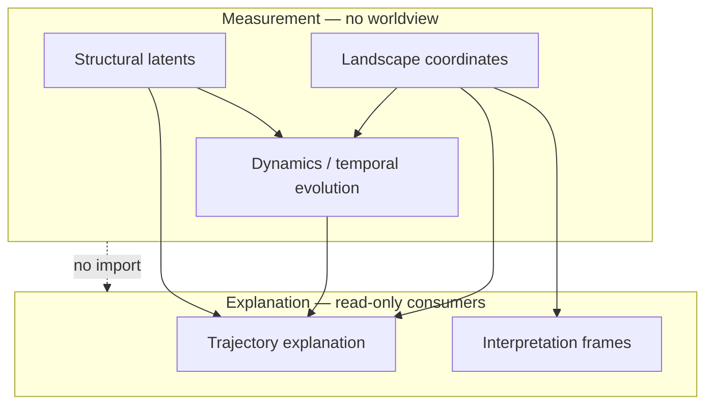

> **Status: Draft** — This document is work in progress and does not yet represent an accepted programme commitment.

# CLRP-005: Layer Separation

## Abstract

CLRP requires strict separation between **measurement**, **dynamics**, **structure**, **trajectory explanation**, and **interpretation**. Mixing layers causes ethical harm (diagnostic creep), scientific confusion (causal claims from metaphors), and implementation rot (feedback loops).

## 1. Layer definitions

### Landscape (measurement)

**Produces:** coordinate vectors and uncertainty from observations.  
**Must not:** assign diagnostic labels, moral judgement, or causal real-world claims.

### Dynamics

**Produces:** modelled state transitions over time.  
**Must not:** conflate simulated change with observed change without labelling.

### Structural

**Produces:** latent parameter estimates constraining measurement and dynamics.  
**Must not:** reify latents as immutable traits of moral or clinical significance.

### Trajectory explanation

**Produces:** mechanistic account of **how** coordinates changed **within the model**.  
**Must not:** claim real-world etiology, treatment need, or modify coordinates.

### Interpretation

**Produces:** human-readable reading of coordinates in an explicit, **non-causal** frame.  
**Must not:** alter measurement functions or present frames as sole truth.

## 2. Normative rules

| Rule | Statement |
|------|-----------|
| **R1** | Measurement layers must not depend on interpretation content |
| **R2** | Interpretation may consume measurement outputs read-only |
| **R3** | User worldview selection must not change scores (M6, CLRP-003) |
| **R4** | Simulation outputs must be labelled "simulated" in user-facing contexts |
| **R5** | Trajectory explanation must not introduce new coordinate values |

## 3. Conformance testing

Implementations claiming CLRP-005 conformance should provide **automated or manual tests** demonstrating forbidden dependencies are absent. Test definitions may live in implementation repos; requirements live here.

## 4. Ethical rationale

Layer violations correlate with:

- Diagnostic language entering results screens
- Gamification that optimises interpretation feedback into answers
- Institutions treating narrative summaries as assessment scores

See [CLRP-007](CLRP-007-non-diagnostic-commitment.md).

## 5. Non-goals

- Mandating specific package names or programming patterns
- Prohibiting optional bundling of layers at **application** boundary (with clear labelling)

## Revision history

| Version | Date | Status | Summary |
|---------|------|--------|---------|
| 0.1.0 | 2026-07-07 | Draft | Initial publication |

## References

- [CLRP-002](CLRP-002-vocabulary.md)
- [CLRP-003](CLRP-003-measurement-principles.md)
