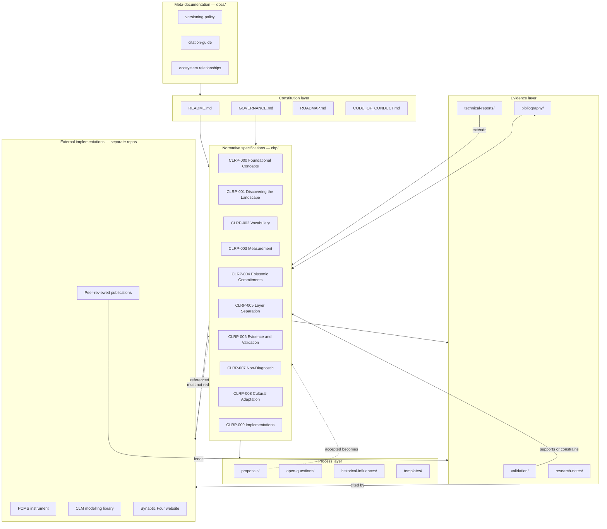
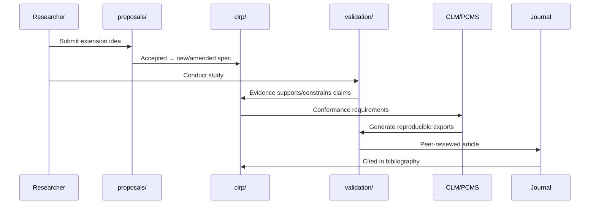

# Repository architecture

This document describes the information architecture of the Cognitive Landscape Research Programme repository.

## Architecture diagram



## Layer descriptions

### Constitution layer

Top-level files define **who**, **how**, and **when**. They change rarely and require extended review.

| Artifact | Function |
|----------|----------|
| README.md | Public entry point; programme summary |
| GOVERNANCE.md | Decision authority, roles, succession |
| ROADMAP.md | Multi-year programme milestones |
| CONTRIBUTING.md | Contribution process |
| CHANGELOG.md | Release and status history |

### Normative specifications (`clrp/`)

The **authoritative programme text**. Answers: what we commit to, what we exclude, how terms are defined.

- Implementation-independent
- Versioned and status-tracked
- Citable by ID

### Evidence layer

Empirical and methodological support **without** replacing specifications.

| Collection | Role |
|------------|------|
| `validation/` | Protocols, study reports, evidence summaries |
| `technical-reports/` | Long-form methods and analyses (CLRP-TR) |
| `research-notes/` | Dated exploratory notes (CLRP-RN) |
| `bibliography/` | Shared references |

Evidence documents may **contradict** draft specs — that tension drives revision.

### Process layer

| Collection | Role |
|------------|------|
| `proposals/` | Extensions awaiting acceptance |
| `open-questions/` | Explicit uncertainty register |
| `historical-influences/` | Intellectual lineage |
| `templates/` | Authoring scaffolds |

### Meta-documentation (`docs/`)

Policies for maintaining the repository itself: versioning, citation, ecosystem boundaries.

### External implementations

Separate repositories. Dependency direction:

```
CLRP (normative) ──▶ implementations (descriptive + conformant)
implementations ──✕▶ CLRP (must not silently override)
```

## Information flow



## Directory tree

```
cognitive-landscape-research-programme/
├── README.md                    # Entry point
├── GOVERNANCE.md                # Constitution
├── ROADMAP.md                   # Programme roadmap
├── CHANGELOG.md
├── CONTRIBUTING.md
├── CODE_OF_CONDUCT.md
├── SECURITY.md
├── CITATION.cff
├── LICENSE                        # MIT (scripts)
├── LICENSE-docs                   # CC BY 4.0 (documentation)
│
├── clrp/                          # CLRP-NNN specifications
│   ├── index.md
│   └── CLRP-NNN-*.md
│
├── technical-reports/             # CLRP-TR-YYYY-NNN
├── research-notes/                # CLRP-RN-YYYY-NNN
├── validation/                    # CLRP-VR-YYYY-NNN
├── proposals/                     # CLRP-P-YYYY-NNN
├── open-questions/
├── bibliography/
├── historical-influences/
│
├── templates/                     # Authoring templates
├── docs/                          # Meta-documentation
│   ├── architecture/
│   ├── versioning/
│   ├── citation/
│   └── ecosystem/
│
└── scripts/                       # Maintenance tooling (MIT)
```

## Design constraints

1. **No participant data** in the repository.
2. **No implementation code** beyond maintenance scripts.
3. **No instrument-specific item banks** — those belong in instruments.
4. **Separation of evidence and commitment** — validation reports do not auto-upgrade spec status.
5. **Long-term readability** — plain Markdown, minimal build dependencies.

## Future extensions (not yet implemented)

Reserved for programme growth without restructuring:

| Extension | Location |
|-----------|----------|
| Link-check CI | `.github/workflows/link-check.yml`, `scripts/validate-catalog.py` |
| Zenodo DOI automation | `.zenodo.json`, `docs/zenodo-integration.md` |
| Document index CI | validates frontmatter, broken links |
| Quarto PDF exports | optional `render/` directory |
| Translations | `clrp/locale/` with attribution per CLRP-008 |

---

**Version:** 1.0.0  
**Status:** Accepted
